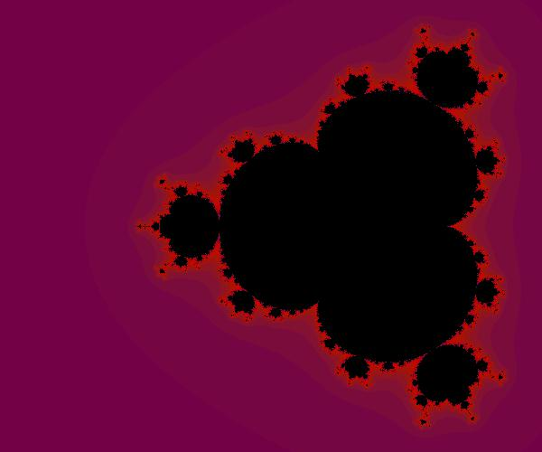

# Fractals with TensorFlow

Using tensorflow to compute mandelbrot sets that fulfill a certain set of criteria:
  * is a complex number
  * which does not diverge by several applications of below function

The result set can be seen like this as you know.

